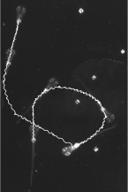

## Tracking freely behaving specimens in real time

PyTorch package for high precision, ultra low latency behavioral tracking (< 4 ms/frame, > 250 Hz), utilizing prior-informed position estimation and inference runtime optimization.

Here an example of a zebrafish (danio rerio) larva in a behavioral chamber (512 x 512 pxl, red dot is the tracker):

# https://user-images.githubusercontent.com/43091450/188277834-35c8ed09-43a9-4e47-a016-41ec4c3800bc.mp4
